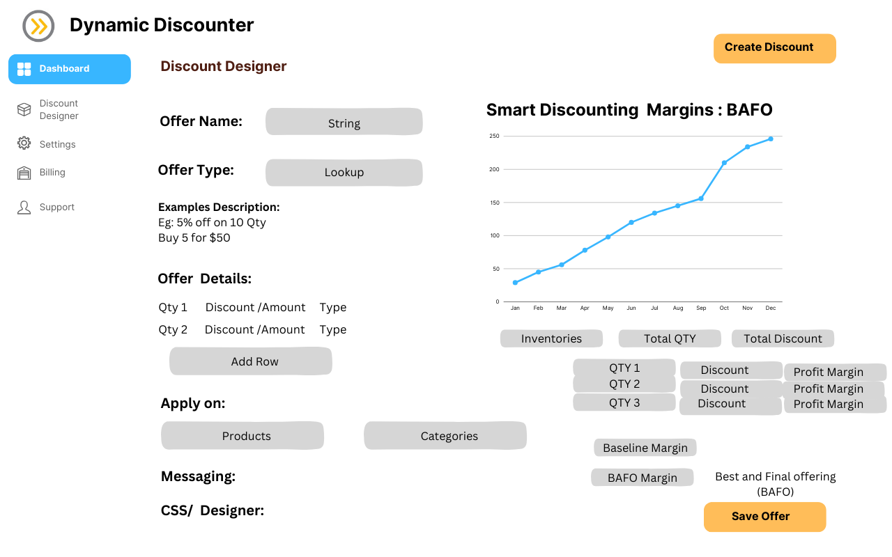

                                                 Welcome to Propero's discounting app.
                                                        Dynamic Discounter
The new look of  discounts
Built with ReactJs and [Remix]

Developed by Propero (https://www.propero.in/)

Thinking about the daily problems that we face with e-commerces, one thing that frustrates us both is the inability to view and apply our discount codes before getting to the cart or simulating a purchase to get to checkout.

The problem is even bigger when you consider today's technology and it's not possible to do a simple thing like that. To solve this problem, we came up with Dynamic Discounter.

-> Dynamic Discounter is an embedded app made for Shopify. You can add it to your store and it works like this: Once the customers are looking through the store, they see a floating button and once they click, it opens a bar on the top of the page.

All you need to do is insert the discount code there and it applies to the whole website. You can visualize the discounts - on the applicable products - instantaneously on every page. You don’t need to keep checking your cart or wait until checkout.

The discount bar can be customized according to the website layout.

Using the app
As an embedded app, Dynamic Discounter was installed on our dev store and it has all the Installation/OAuth authentication routes and methods, being ready for the app store. The only permissions that we ask are to change themes and assets using the Shopify API.

-->Installing and configuring this repository

-->git clone this repository

-->Install node package manger to manage node dependencies

--->Copy .env.example to .env

--->Configure your database and Shopify keys on .env

-----------------------------------------------------------------------------------------------------------------------------
                                           "Requirements"

----->Install Node.js 18 or higher(v20.10.0), and ruby(ruby 3.2.2 (2023-03-30 revision e51014f9c0) [x64-mingw-ucrt])

----->npm install on the project folder

----->You've installed a Node.js package manager.

----->You're using the latest version of Chrome or Firefox.

*Because Shopify CLI requires a conventional directory structure, if you're creating a new app, then you should run one of the following commands to initialize your app:                                ----------->>>npm init @shopify/app@latest <<<----------------------------------

----------------------->>>> Select remix framework to get started followed by selecting appropriate app and store .

----------------------->>>> Install app from shopify dashboard(for 1st time)

Reference ---> https://shopify.dev/docs/apps/tools/cli

          ---> https://shopify.dev/docs/apps/tools/polaris
          
          ---> https://shopify.dev/docs/apps/tools/graphiql-admin-api

    
  <!-- Add more images as needed -->

